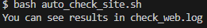
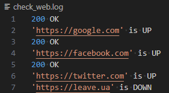

# Results

## Task 1. Write a script that automatically checks if certain websites are available. The script should use the curl command to send HTTP GET requests to each site in the list and check the response.

When you type **bash auto_check_site.sh** in the terminal, you will see the message _You can see results in check_web.log_

### Example of program operation

